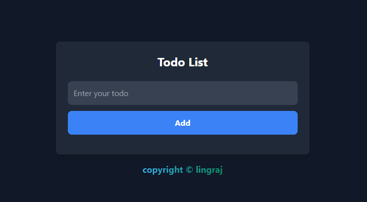
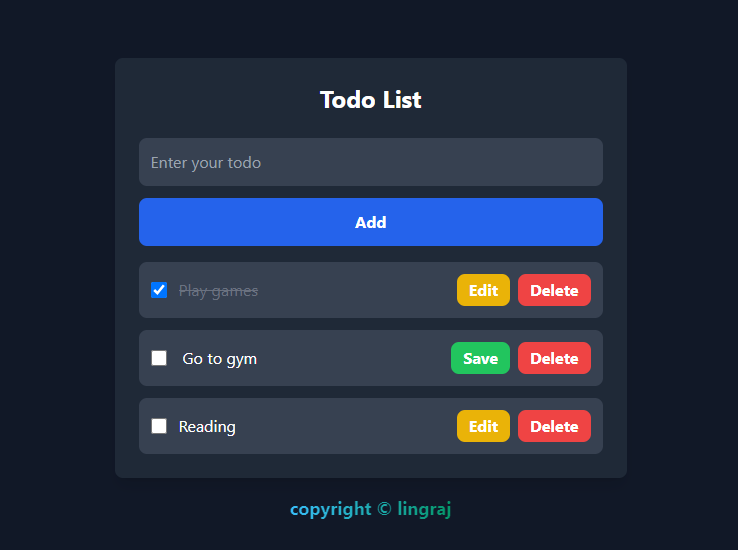

# Simple Todo Application

This is a basic todo list application built using HTML, CSS, and JavaScript. It demonstrates the use of DOM manipulation to create a dynamic, interactive user interface.

## Features

- Add new todo items
- Mark todo items as complete
- Delete todo items
- Filter todo items (All, Active, Completed)
- Clear all completed todo items

## Technologies Used

- HTML5
- TailwindCSS
- JavaScript (ES6+)

## How It Works

The application uses vanilla JavaScript to manipulate the DOM, creating a dynamic user interface without the need for a framework. Here's a brief overview of its functionality:

1. **Adding Todos**: Users can input a todo item and press enter. The JavaScript code creates a new todo element and appends it to the todo list in the DOM.

2. **Completing Todos**: Clicking on a todo item toggles its completed state. This is achieved by adding/removing a 'completed' class and updating the todo's status in the underlying data structure.

3. **Deleting Todos**: Each todo item has a delete button. Clicking this button removes the todo from both the DOM and the data structure.

4. **Filtering Todos**: Users can filter todos based on their status (All, Active, Completed). This is done by manipulating the display property of todo items based on their completed status.

5. **Clearing Completed**: This functionality removes all completed todos from both the DOM and the data structure.

## Setup and Usage

1. Clone this repository to your local machine.
2. Open the `index.html` file in a web browser.
3. Start adding, completing, and managing your todos!

